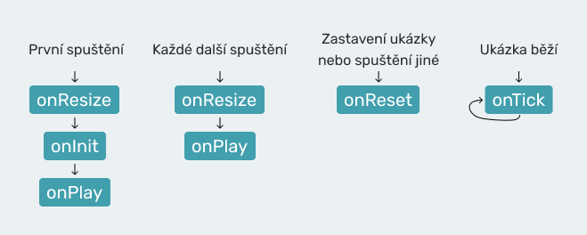

# Three.js Návod

Tento projekt jsou webové stránky, na kterých se nachází tutoriál se spoustou interaktivních ukázek o JavaScript knihovně jménem Three.js. Můžete se na ně podívat __[zde](https://jirkasa.github.io/threejs-navod/)__.

## Spuštění/sestavení webu

V tomto projektu se používá Webpack. Pokud si chcete web spustit lokálně na svém počítači nebo jej sestavit pro produkci, tak nejprve musíte nainstalovat NPM balíčky.

    npm install

Po instalaci můžete projekt spustit pro vývoj, nebo jej sestavit pro produkci. Po spuštění následujícího příkazu se vám spustí Webpack Dev Server a web se vám otevře v prohlížeči. Poté můžete na webu pracovat a uprovovat kód.

    npm run dev

Pokud chcete aplikaci sestavit pro produkci, můžete to udělat pomocí následujícího příkazu. V kořenové složce se vám poté objeví složka dist s finálním kódem.

    npm run build

## Souborová struktura projektu

Zde jsem sepsal a popsal soubory a složky, které se nachází v kořenové složce projektu.

| soubor/složka    | popis                                                                                             |
| ---------------- | ------------------------------------------------------------------------------------------------- |
| main.js          | webpack entry pro všechny stránky webu (jen se tam importují CSS styly)                           |
| index.html       | domovská stránka webu                                                                             |
| tutorial         | tato složka obsahuje stránky pro všechny části tutoriálu                                          |
| obsah            | tato složka obsahuje stránku s obsahem tutoriálu                                                  |
| 3d-modely        | tato složka obsahuje stránku s 3D modely ke stažení                                               |
| includes         | tato složka obsahuje začátek a konec stránky pro části tutoriálu (a obsah)                        |
| js               | tato složka obsahuje JavaScript soubory (jsou na stránky přidávány podle Webpack konfigurace)     |
| static           | tato složka obsahuje assety jako jsou obrázky, 3D modely, textury, a další různé soubory          |
| css-images       | tato složka obsahuje obrázky, které se používají přes CSS styly                                   |
| less             | tato složka obsahuje LESS soubory s CSS styly                                                     |

## Jak fungují interaktivní ukázky

Pokud vás zajímá, jak fungují v kódu interaktivní ukázky, které se na webu nacházejí, tak jsem to tu trochu popsal. Funguje to tak, že pro interaktivní ukázky má každá stránka tutoriálu vlastní složku ve složce js/interactive-examples/pages. Tato složka se musí jmenovat stejně jako stránka (musí mít stejný název jako složka pro samotnou stránku) a musí obsahovat soubor main.js. V souboru main.js se importují interaktivní ukázky pro stránku a inicializuje se InteractiveExamplesRunner. Ten interaktivní ukázky spravuje a spouští je. Zde je příklad, jak může obsah souboru main.js například vypadat.

    import InteractiveExamplesRunner from '../../InteractiveExamplesRunner';

    // naimportování všech interaktivních ukázek pro stránku
    import './example1';
    import './example2';
    import './example3';

    // po zavolání metody init InteractiveExamplesRunneru
    // bodou naimportované interaktivní ukázky připraveny
    InteractiveExamplesRunner.init();

Každý soubor představující interaktivní ukázku vytváří instanci třídy InteractiveExample a nastavuje kód, který se spouští při různých událostech (při prvním spuštění ukázky, při každém spuštění ukázky, při resetu ukázky, atd..). Tyto události jsou níže vysvětleny a zobrazeny na obrázku. První věc, kterou je ale pro vytvoření interaktivní ukázky potřeba udělat, je vytvořit pro ni element na stránce a nastavit mu atribut data-example-id, který představuje ID ukázky.

    

Po vytvoření elementu můžeme v souboru pro interaktivní ukázku vytvořit instanci třídy InteractiveExample a nastavit kód, který se spustí pro různé události. Jak to můžeme udělat, ukazuje následující okomentovaný kód. Při vytváření instance třídy InteractiveExample předáváme do konstruktoru jako parametr ID ukázky, které jsme nastavili elementu jako data-example-id a můžeme také předat Three.js kameru pro automatické resizování.

    import InteractiveExample from "../../InteractiveExample";
    import * as THREE from 'three';

    // vytvoření kamery
    // (poměr stran není důležitý, nastaví se automaticky
    // při vytvoření interaktivní ukázky)
    const camera = new THREE.PerspectiveCamera(75, 1, 0.1, 10000);

    // vytvoření interaktivní ukázky
    const iExample = new InteractiveExample(1, camera);

    // nastavení kódu, který se spustí při prvním spuštění ukázky
    // (nebo spíš před spuštěním, poté se spustí onPlay)
    iExample.onInit = () => {
        scene = new THREE.Scene()

        const geometry = new THREE.BoxGeometry(1, 1, 1);
        const material = new THREE.MeshBasicMaterial({
            color: 0x78E8FA
        });
        const cube = new THREE.Mesh(geometry, material);

        scene.add(cube);

        scene.add(camera);
        camera.position.z = 3;
    }

    // nastavení kódu, který se bude spouštět každý snímek
    iExample.onTick = () => {
        // renderer pro interaktivní ukázku nevytváříme
        // (je společný pro všechny interaktivní ukázky)
        iExample.renderer.render(scene, camera);
    }

Jak jste v ukázce viděli, tak tvorba interaktivní ukázky funguje tak, že vlastně nastavujeme kód, který se má spustit při různých událostech. Pro jaké události můžeme kód nastavit ukazuje následující tabulka.

| událost         | popis                                                                                     |
| --------------- | ----------------------------------------------------------------------------------------- |
| onInit          | spouští se před prvním spuštění ukázky (před prvním zavolání onPlay)                      |
| onPlay          | spouští se při každém spuštění ukázky                                                     |
| onReset         | spustí se když uživatel zastaví ukázku, nebo spustí jinou                                 |
| onTick          | spouští se každý snímek (jako parametr může přijímat delta time a uběhnutý čas od startu ukázky) |
| onResize        | spouští se při změně velikosti obrazovky (jako parametr může přijímat novou šířku a výšku containeru pro ukázku) - také se spouští před každým spuštěním ukázky (i před onInit) |

Aby jste lépe pochopili kdy se které události spouští, tak jsem vytvořil následující obrázek.

V ukázce kódu jste si také mohli všimnout, že renderer si pro interaktivní ukázky nevytváříme. Ten je totiž společný pro všechny ukázky a máme k němu přístup pomocí vlastnosti renderer. Jaké vlastnosti třída InteractiveExample obsahuje ukazuje následující tabulka.

| vlastnost      | popis                                                                                     |
| -------------- | ----------------------------------------------------------------------------------------- |
| renderer       | společný renderer pro všechny interaktivní ukázky                                         |
| canvas         | společný canvas pro všechny ukázky (vždy se před spuštěním ukázky umístí do jejího containeru) |
| canvasContainer | slouží pro ukázku jako místo, kam se před spuštěním ukázky umístí canvas                 |